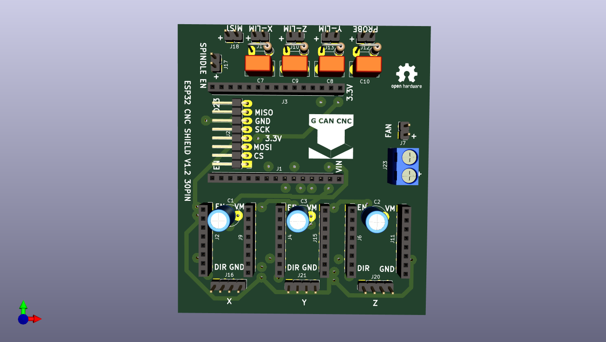

# ESP32_CNC_SHIELD_V1.1_30PIN
 30PIN VERSION OF CNC SHIELD
 
 

Estaba buscando devkits para el ESP32_CNC_SHIELD y encontré uno de 30 pines. Miré la disposición de pines y coincide casi al 100%.
Lo que cambia son los 8 pines que son duplicados o no se usa, así que hize esta versión. Lo hize tan grande porque nesecito espacio para las pistas y se pierde siempre algo cuando lo corta en la fresadora. Si funciona bien hago una versión SMD para encargar.

Voy a verificar si necesito poner MOSFET en el Nebulizador y igual añadir unos pines de 5 Voltios para los finales de carrera y el probe.
